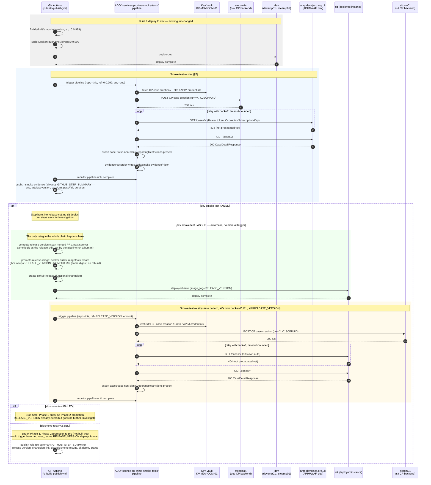
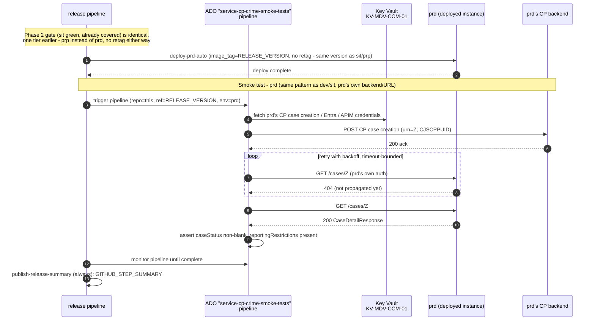

1# End-to-End Smoke Testing Framework — Design

Status: Phase 1 code implemented (dev scope) and verified against real infrastructure; ADO
pipeline wiring for Phase 1 (§7) not yet built; Phase 2/3 not yet built (§4)
Owner: service-cp-crime-prosecution-case-details

## 1. Goal

Automatically validate `getCaseDetailsByCaseUrn` against a real deployed instance of this
service immediately after deploy, using real CP backend data created through legitimate CP
write paths (not static fixtures), and produce auditable evidence for release governance.

The release model is a chain of gated promotions, delivered in three phases (§4):

| Phase | Promotion | Status |
|---|---|---|
| 1 | dev smoke-tested → retag (drop snapshot) → deploy sit → sit smoke-tested | Building now |
| 2 | sit smoke-tested → retag → deploy prp → prp smoke-tested | Future |
| 3 | prp smoke-tested → retag → deploy prd | Future |

## 2. Non-goals

- Not a replacement for unit/integration/apiTest coverage — this is a post-deploy smoke check.
- Not a general-purpose load or performance test.
- Not (yet) a multi-scenario suite — one scenario (`getCaseDetailsByCaseUrn` happy path) today;
  the framework must make adding a second scenario cheap, but a second scenario is out of scope.
- Not a shared cross-service library on day one (see §9 — deferred until a second service adopts
  this pattern).
- **Phase 2 and Phase 3 (§4) are explicitly out of scope for this implementation.** Phase 1
  (dev → sit) is what's being built now. This repo has no prp/prd deploy automation today
  (confirmed — `ci-build-publish.yml`/`ci-released.yml` only wire `deploy-dev`/`deploy-sit`).
  §4 and §10 record the intended shape and open questions for Phase 2/3 for direction only —
  they are not being built now and don't block Phase 1.

## 3. Architecture

The framework lives entirely inside this repo as a new Gradle source set, has zero dependency
on `cpp-apitests` or Maven, and follows this repo's existing client/config conventions
(`RestTemplate`, `AppPropertiesBackend`-style `@Value` config, `CJSCPPUID`-style headers).

```
service-cp-crime-prosecution-case-details/
└── src/smokeTest/java/uk/gov/hmcts/cp/smoketest/
    ├── config/
    │   ├── SmokeTestConfig.java             Standalone @Configuration + @ComponentScan —
    │   │                                    deliberately not Application.class; never boots
    │   │                                    controllers/filters/web server, since this suite
    │   │                                    only makes outbound calls to a remote instance.
    │   │                                    Defines the RestTemplate @Bean (mirrors AppConfig).
    │   └── SmokeTestProperties.java         @Service, @Value-injected from application.yaml's
    │                                        smoke: block — same style as AppPropertiesBackend.
    │                                        cjscppuid and backendBaseUrl are read directly
    │                                        from the top-level cjscppuid property and
    │                                        progression-client.url (no smoke.*-prefixed
    │                                        duplicates of values that already exist).
    ├── clients/
    │   ├── SpiInDataFixtureClient.java      @Component. Mirrors ProgressionClient's shape.
    │   │                                    POSTs a minimal CP case creation message to the raw CP
    │   │                                    backend ingress (progression-client.url,
    │   │                                    e.g. steccm14). CJSCPPUID auth.
    │   ├── CaseDetailsSmokeClient.java      @Component. GET {smoke.service-base-url}/cases/
    │   │                                    {urn} through the Azure APIM/WAF gateway — calls
    │   │                                    the deployed service's own public contract, i.e.
    │   │                                    exercises getCaseDetailsByCaseUrn itself. Doubles
    │   │                                    as the data-readiness probe and the assertion
    │   │                                    target. Auth: Entra bearer token (via
    │   │                                    EntraTokenClient) + Ocp-Apim-Subscription-Key —
    │   │                                    not CJSCPPUID, that's the case creation call's concern only.
    │   └── EntraTokenClient.java            @Component. Entra ID client-credentials grant
    │                                        against login.microsoftonline.com; fetched fresh
    │                                        per call (smoke tests are low-frequency, caching
    │                                        isn't worth the complexity).
    ├── fixtures/
    │   ├── SpiInMessageBuilder.java         @Component. Loads spi-in-minimal.xml, fills in a
    │   │                                    generated URN/request ID/hearing date/address.
    │   └── resources/spi-in-minimal.xml     One minimal template, owned by this repo — copied
    │                                        in, not imported from cpp-apitests.
    ├── evidence/
    │   └── EvidenceRecorder.java            @Component. Writes request/response bodies +
    │                                        timestamps to build/smoke-evidence/ for the
    │                                        reporting job.
    └── GetCaseDetailsByCaseUrnSmokeIT.java   @SpringBootTest(classes = SmokeTestConfig.class,
                                              webEnvironment = NONE). Generate URN → submit via
                                              SpiInDataFixtureClient → poll
                                              CaseDetailsSmokeClient until 200 → assert
                                              caseStatus non-blank, reportingRestrictions
                                              present (the real contract's only fields).
```

Phase 2/3 (sit → prp, prp → prd, §6) have no code yet — future scope, not built (see §2, §4, §6).
When built, they reuse this same tree unchanged, just pointed at prp's/prd's own environment
config — no new classes needed, same reasoning as sit's smoke test reusing dev's code (§4).

Key simplification: the data-readiness wait is the deployed service's own endpoint, retried
until it stops 404ing — no direct polling of `progression-query-api` or `prosecutionCaseFile` is
needed, because the thing we're waiting for is exactly the thing under test.

## 4. Environment strategy — three phases, each a gated promotion

**Every tier — dev, sit, prp, and prd — gets the identical smoke test: create a fresh case via
CP case creation against that tier's own CP backend, then verify it through that tier's own service URL.**
This is a deliberate, explicit decision, stated directly in this session — prd is not treated as
a special case with a read-only canary check; it gets the same write-then-verify pattern as
every other tier. Worth being plain about what that means: this framework will create real
synthetic case records in production via automated CP case creation calls, on every release that reaches
prd. That's the accepted design, not an oversight — recorded here so it's a visible, deliberate
choice for whoever reviews this doc, not something buried in a diagram.

**Only one retag ever happens, in Phase 1** — the snapshot version becomes the release version
once, when dev's smoke test first passes. Every promotion after that (sit → prp, prp → prd)
deploys that exact same already-released version tag forward; there's no second or third retag
event, since the artifact's release identity is fixed the moment it's first cut.

| Phase | Promotion gate | Source tier smoke-tested? | Retag? | Target tier | Target tier smoke-tested? | Status |
|---|---|---|---|---|---|---|
| 1 | dev green | Yes — dev: create CP case, verify case details retrievable | **Yes — snapshot → release version, the only retag** | sit | Yes — sit: create CP case, verify case details retrievable | **Building now** |
| 2 | sit green | *(already covered by Phase 1)* | No — same release version deploys forward | prp | Yes — prp: create CP case, verify case details retrievable | Future |
| 3 | prp green | *(already covered by Phase 2)* | No — same release version deploys forward | prd | Yes — prd: create CP case, verify case details retrievable | Future |

**Phase 1 scope precisely:** dev build → dev smoke test → retag (the only one, ever) → deploy
sit → sit smoke test. Stops there — no auto-promotion beyond sit is built in Phase 1; that's
Phase 2's job.

**Each tier's smoke test is a second, independent run of the same pattern, not a re-check of the
previous tier's result.** Sit's run creates its own case via CP case creation against sit's own CP backend
(`cpbackendenv: sitccm01`, per this repo's existing `deploy-sit` job) and verifies through sit's
own service URL — same code (`src/smokeTest`), different environment config, same as running
`./gradlew smokeTest` a second time with sit's values instead of dev's. Prp and prd (Phase 2/3)
follow the identical shape against their own respective backends and service URLs. This exists
because the promoted artifact is the same *bits* at every stage, but each tier's *environment*
(its own CP backend, its own network path, its own APIM/WAF registration) hasn't itself been
verified until its own smoke test runs — the bits being pre-tested doesn't guarantee the
environment they're landing in is configured correctly.

**Phase 2 and Phase 3 are not built now.** This repo has no prp/prd deploy job today
(`ci-build-publish.yml`/`ci-released.yml` only wire `deploy-dev`/`deploy-sit`) — there's no
trigger to attach Phase 2/3 to yet regardless. When that automation exists, Phase 2/3 should be
scoped as separate follow-on work, reusing Phase 1's pattern exactly (§5's sequence, retargeted).

## 5. Sequence — Phase 1: dev smoke test → gated auto-release → deploy sit → sit smoke test

**Governance note — read before implementing:** this replaces today's manual gate. Currently
sit only deploys when a human publishes a GitHub Release (`ci-released.yml`, `release: published`
trigger). This design removes that human step for the default path: a green smoke test on dev is
what authorises a release and a sit deploy, with no one clicking "publish." `ci-released.yml`
stays as a manual override path (e.g. hotfixes) — it's not being deleted, just no longer the only
route to sit. This is a deliberate scope decision, not an incidental side effect — confirm it's
the intended release governance model before building it.



`0.0.999` is the current placeholder draft version string this repo's `Artefact-Version` job
already produces for non-release builds (`ARTEFACT_VERSION` default) — unchanged by this design,
just the thing being promoted rather than rebuilt. `RELEASE_VERSION` is the computed semver, cut
once and carried unchanged through every later phase.

## 6. Sequence — Phase 2 / Phase 3 (sit→prp, prp→prd) — FUTURE SCOPE, not built now

Both phases reuse §5's exact pattern — smoke test the source tier (already done, from the
previous phase), deploy the same `RELEASE_VERSION` (no retag) to the next tier, then run that
tier's own smoke test (its own CP backend, its own service URL). The sequence below sketches
Phase 3 (prp → prd) as the representative shape; Phase 2 (sit → prp) is identical, one tier
earlier. Not part of this implementation (§2, §4) — no prp/prd code, pipeline parameters, or ADO
wiring is being built in this round. Included so a future iteration doesn't have to re-derive it.



Same pattern as dev/sit throughout (§5) - real CP case creation against prd's own backend,
not a read-only canary check. That's the explicit decision recorded in §4, not an oversight here.

## 6a. Network reachability — why ADO, narrowed

**In plain terms:** the smoke test does two things — (1) creates a test case, and (2) checks that
the case shows up correctly. Creating the test case can only be done from inside HMCTS's private
network, because that system isn't exposed to the internet. Checking the result *could* be done
from anywhere, including a standard internet-based build server, because it goes through a secure
public gateway (Azure API Management) rather than directly into the private network. Since both
steps run together as one piece of work today, and splitting them apart would add complexity for
no real benefit, we're keeping the whole test running from inside the private network — even
though, strictly speaking, only the first step requires it.

**POC completed 2026-07-03 — confirmed from the real internal build agent.** A connectivity check
was run from the actual agent pool this framework would use (`MDV-ADO-AGENT-AKS-01`, paired with
cluster `K8-STE-CS01-CL01`). Both targets below were genuinely reachable from that agent — this
is no longer an assumption. (The equivalent check from a GitHub-hosted runner — expected to show
the private target as unreachable — hasn't been run yet; lower priority now the main question is
settled, since RFC1918 private addresses are unroutable over the public internet as a matter of
networking fact, not something that needed empirical proof the way the agent-pool question did.)

| Call | Target | Reachability | Confirmed from the internal build agent? |
|---|---|---|---|
| Create test case | `steccm14.ingress01.ste.nl.cjscp.org.uk` (internal CP system, cluster `K8-STE-CS01-CL01`) | Private — resolves to an internal address, not reachable from the public internet | **Yes** — DNS resolved, TCP connected on 443, TLS handshake completed |
| Check the result | `amp.dev.cjscp.org.uk` (public API gateway) | Public — reachable from anywhere, secured by its own login/API key | **Yes** — full TLS handshake against a real certificate, real HTTP response received |

This POC covered dev's infrastructure specifically. Sit, prp, and prd (§4, Phase 1-3) each have
their own CP backend and their own agent-pool pairing (per the "agent pools are paired to a
specific cluster" finding above) — this result doesn't automatically extend to them. Each new
phase should confirm reachability for its own tier's backend before relying on it, the same way
this POC did for dev, not assume it's already covered.
**One real finding along the way: an agent pool is paired to a specific cluster, not "the private
network" in general.** The first POC attempt targeted `steccm64` — a different, genuinely live
internal system, just hosted on cluster `K8-DEV-CS01-CL02` rather than `K8-STE-CS01-CL01` — and
failed outright with a DNS resolution error from this agent pool. Retargeting at `steccm14` (on
`K8-STE-CS01-CL01`, the cluster this agent pool is actually paired with) succeeded immediately.
Takeaway: this agent pool reaches the specific cluster it's provisioned for, not every
HMCTS-internal cluster. If this framework ever needs to reach a backend on a different cluster,
it needs a matching agent pool for *that* cluster — "an ADO agent" is not a blanket guarantee of
reaching any given private CP system.

**Why this doesn't change the recommendation.** Both steps happen as one piece of work today, and
the same agent pool run reached both targets in a single execution — there's no need to split the
test across two differently-hosted steps. A build agent that can already reach the private CP
system can also reach the
public internet by default; it's the *private* route that needs special setup, not the other way
round. Splitting the test across two separately-hosted steps would mean passing the generated
case reference between two different pipelines — real added complexity for no practical benefit.

**Net effect:** confirmed — keep the whole test running on the internal build agent, as designed,
paired with the cluster the target CP backend actually lives on (`K8-STE-CS01-CL01` for this
service's `steccm14` target). The result check being public doesn't remove the need for the
private network — it just means creating the test case, not checking the result, is the actual
reason that requirement exists.

## 7. CI/CD design

### Changes to service GitHub Actions workflow (`ci-build-publish.yml`)

Phase 1 smoke-tests both dev and sit — sit
gets its own run, not just a promoted, untested image (see §4). New jobs follow the exact
pattern already used for `Deploy`/`Wait-For-ACR-Push`:

```yaml
run-smoke-tests-dev:
  needs: [deploy-dev]
  steps:
    - uses: hmcts/trigger-ado-pipeline@v2
      with:
        pipeline_id: <service-cp-crime-smoke-tests pipeline id>
        template_parameters: >
          {
            "repository": "hmcts/service-cp-crime-prosecution-case-details",
            "ref": "${{ needs.Artefact-Version.outputs.artefact_version }}",
            "env": "dev",
            "stack": "steamp01",
            "cpbackendStack": "steccm14",
            "cluster": "K8-STE-CS01-CL01",
            "serviceHealthUrl": "https://amp.dev.cjscp.org.uk/prosecution-case/actuator/health/readiness"
          }
    - uses: hmcts/monitor-ado-pipeline@v1
      with: { pipeline_id: ..., run_id: ... }

publish-smoke-evidence-dev:
  needs: [run-smoke-tests-dev]
  if: always()
  steps:
    - # download ADO build artifacts (JUnit + evidence) for the completed run
    - # write GITHUB_STEP_SUMMARY: env, artefact version, caseUrn, pass/fail, duration
    - uses: actions/upload-artifact@v6

# --- Below: only if run-smoke-tests-dev succeeded. Automatic — no manual release trigger (§5 governance note). ---
# --- This is the ONLY retag in the whole Phase 1-3 chain (§4) - Phase 2/3 never retag again. ---

compute-release-version:
  needs: [run-smoke-tests-dev]
  if: success()
  steps:
    - # same PR-scan/semver logic as the `release` skill, invoked here instead of by a human
    - # outputs: release_version

promote-release-image:
  needs: [compute-release-version]
  steps:
    - run: |
        docker buildx imagetools create \
          --tag ghcr.io/${{ github.repository }}:${{ needs.compute-release-version.outputs.release_version }} \
          ghcr.io/${{ github.repository }}:${{ needs.Artefact-Version.outputs.artefact_version }}
      # re-tags the exact digest already smoke-tested on dev - no rebuild, and no later phase
      # repeats this step, they all deploy this same release_version forward (§4)

create-github-release:
  needs: [compute-release-version, promote-release-image]
  steps:
    - uses: gh release create ${{ needs.compute-release-version.outputs.release_version }} --notes-file <generated-changelog>

deploy-sit-auto:
  needs: [create-github-release]
  steps:
    - uses: hmcts/action-ado-deploy@v1
      with:
        image_tag: ${{ needs.compute-release-version.outputs.release_version }}
        target_branch: env/sit
        # same shape as the existing manual deploy-sit job in ci-released.yml — triggered here
        # automatically instead of by a human publishing a release

run-smoke-tests-sit:
  needs: [deploy-sit-auto]
  steps:
    - uses: hmcts/trigger-ado-pipeline@v2
      with:
        pipeline_id: <same "service-cp-crime-smoke-tests" pipeline as dev>
        template_parameters: >
          {
            "repository": "hmcts/service-cp-crime-prosecution-case-details",
            "ref": "${{ needs.compute-release-version.outputs.release_version }}",
            "env": "sit",
            "stack": "sitamp01",
            "cpbackendStack": "sitccm01",
            "cluster": "K8-SIT-CS01-CL02",
            "serviceHealthUrl": "https://amp.sit.cjscp.org.uk/prosecution-case/actuator/health/readiness"
          }
    - uses: hmcts/monitor-ado-pipeline@v1
      with: { pipeline_id: ..., run_id: ... }

publish-release-summary:
  needs: [run-smoke-tests-sit]
  if: always()
  steps:
    - # write GITHUB_STEP_SUMMARY: release version, changelog link, dev+sit smoke results,
    - #   sit deploy status, link back to the runs that authorised this release (audit trail)
    - # if run-smoke-tests-sit failed: Phase 1 ends here (§4/§5) - no Phase 2 trigger exists yet
```

`ci-released.yml` (the existing `release: published` trigger) is unchanged and stays available
as a manual override path — e.g. a hotfix that needs to reach sit without a full dev cycle. It's
no longer the *only* route to sit once this is built.

### New ADO pipeline: `service-cp-crime-smoke-tests`

Same shape as pipelines 434/460 — one
definition, parameterized, callable by any `service-cp-*` repo, and called *twice* per Phase 1
run (once for dev, once for sit) with different `template_parameters` — not two separate
pipeline definitions.

The pipeline has two stages: `AcquireLock` (serial-queue gate + health-check gate) and
`SmokeTest` (the actual Gradle run). This separation ensures that if the health check
times out, the test stage never starts and the failure is attributed to the right gate.

**Concurrency design — serial queue via ADO exclusive environment lock**

When multiple `service-cp-*` repos deploy to dev concurrently and both trigger this pipeline,
ADO queues the runs: the first run acquires the `cp-crime-smoke-tests-dev` environment lock and
executes; the second waits at `AcquireLock` until the first's `SmokeTest` completes and
releases the lock. No runs are dropped — all execute, one at a time. This is ADO's native
`lockBehavior: sequential` mechanism on a deployment environment.

**Health-check gate** — after the lock is granted and before `SmokeTest` starts, the pipeline
polls the deployed service's `/actuator/health/readiness` endpoint every 15 seconds (up to
20 attempts = 5 minutes). A non-200 response means the pod rolled out but is not yet serving;
a timeout means the deployment is unhealthy. Either way, `AcquireLock` fails, `SmokeTest` is
skipped, and the lock is released so the next queued run can proceed. This prevents a
bad deployment from producing misleading smoke test results.

```yaml
trigger: none

parameters:
  - name: repository       # e.g. "hmcts/service-cp-crime-prosecution-case-details"
  - name: ref               # deployed tag (dev's snapshot version, or sit's release_version)
  - name: gradleTask
    default: "smokeTest"
  - name: env               # dev | sit for Phase 1 (prp | prd added in Phase 2/3, see §6)
  - name: stack              # e.g. steamp01 | sitamp01
  - name: cpbackendStack     # e.g. steccm14 | sitccm01
  - name: cluster            # K8-STE-CS01-CL01 | K8-SIT-CS01-CL02 etc.
  - name: serviceHealthUrl   # /actuator/health/readiness URL — empty = skip health check
    default: ''

variables:
  - ${{ if eq(parameters.env, 'dev') }}:
    - group: cp-crime-smoke-tests-dev   # KV-MDV-CCM-01-linked — CP case creation/Entra/APIM creds
  - ${{ if eq(parameters.env, 'sit') }}:
    - group: cp-crime-smoke-tests-sit

stages:
  # ── Stage 1: serial-queue gate + health-check gate ──────────────────────────
  - stage: AcquireLock
    displayName: Acquire exclusive lock + verify readiness
    jobs:
      - deployment: AcquireLock
        displayName: Queue for exclusive access (${{ parameters.env }})
        # ADO environment prerequisite: create cp-crime-smoke-tests-dev and
        # cp-crime-smoke-tests-sit in ADO project cpp-apps (Environments → New → Resource: None)
        # then enable Exclusive lock → Sequential on each.
        environment: cp-crime-smoke-tests-${{ parameters.env }}
        lockBehavior: sequential     # queues concurrent triggers; each runs in turn
        pool:
          # Must resolve per parameters.cluster — agent pools are paired to a specific cluster,
          # not "the private network" in general (confirmed via POC, §6a).
          # MDV-ADO-AGENT-AKS-01 confirmed for K8-STE-CS01-CL01 (dev).
          # Equivalent pool for K8-SIT-CS01-CL02 (sit) needs confirming (§10, item 6).
          name: "<AKS-embedded agent pool matching ${{ parameters.cluster }}>"
        strategy:
          runOnce:
            deploy:
              steps:
                - script: |
                    echo "Lock acquired — env=${{ parameters.env }} ref=${{ parameters.ref }}"
                  displayName: Lock granted

                # Health-check gate: only runs when caller passes serviceHealthUrl.
                # Polls every 15 s up to 5 min. Failure here blocks SmokeTest and
                # releases the lock so the next queued run can proceed.
                - ${{ if ne(parameters.serviceHealthUrl, '') }}:
                  - script: |
                      echo "Polling ${{ parameters.serviceHealthUrl }}"
                      for i in $(seq 1 20); do
                        STATUS=$(curl -sf -o /dev/null -w "%{http_code}" \
                          "${{ parameters.serviceHealthUrl }}" || echo "000")
                        echo "Attempt $i: HTTP $STATUS"
                        [ "$STATUS" = "200" ] && exit 0
                        sleep 15
                      done
                      echo "##vso[task.logissue type=error]Readiness check timed out after 5 min"
                      exit 1
                    displayName: Wait for service readiness

  # ── Stage 2: actual smoke test run ──────────────────────────────────────────
  - stage: SmokeTest
    displayName: Smoke Test (${{ parameters.env }})
    dependsOn: AcquireLock
    jobs:
      - job: RunSmokeTests
        pool:
          name: "<AKS-embedded agent pool matching ${{ parameters.cluster }}>"
        steps:
          - checkout: none
          - # reused from pipeline 340: generate GitHub App token
          - # git clone ${{ parameters.repository }} @ ${{ parameters.ref }}
          - # resolve ingress host: https://{stack}.ingress01.{env==sit?sit:ste}.nl.cjscp.org.uk:443
          - # fetch CP case creation/Entra/APIM credentials from variable group (already loaded above)
          - CmdLine@2: |
              ./gradlew ${{ parameters.gradleTask }} \
                -DsmokeServiceBaseUrl=... \
                -DsmokeBackendUrl=https://$(stack).ingress01....
          - PublishTestResults@2     # build/test-results/smokeTest/*.xml
          - PublishBuildArtifacts@1  # build/smoke-evidence/
```

**ADO environment prerequisites (one-off, before first run):**

| Environment name | ADO project | Lock setting |
|---|---|---|
| `cp-crime-smoke-tests-dev` | `cpp-apps` | Exclusive lock → Sequential |
| `cp-crime-smoke-tests-sit` | `cpp-apps` | Exclusive lock → Sequential |

Create via: Pipelines → Environments → New environment → Resource type: None → then ⋮ menu →
Approvals and checks → Exclusive lock → Sequential.

Any future `service-cp-*` repo adopts this by: (1) satisfying the three source conventions
(§7 Gradle task, JUnit XML path, evidence dir path), (2) having the GitHub App installed, and
(3) passing its own `serviceHealthUrl` in `template_parameters`.

## 8. Reporting / evidence strategy

- **JUnit XML** — standard, published as ADO test results and as a GitHub Actions artifact.
- **Evidence bundle** (`build/smoke-evidence/`) — per-run JSON: request/response bodies (SOAP
  POST and GET), the generated caseUrn, timestamps, environment/cluster/artefact version. One
  bundle per tier per run (dev's and sit's are separate artifacts in Phase 1; prp's and prd's
  will be too once Phase 2/3 exist). No real PII — every tier's data is synthetic, generated
  fresh by that tier's own smoke test run (§4) — there's no pre-seeded canary anywhere in this
  design.
- **GitHub Actions job summary** (`GITHUB_STEP_SUMMARY`) — three, at three points in the Phase 1
  pipeline (§5, §7): (1) `publish-smoke-evidence-dev` — pass/fail, env, artefact version,
  caseUrn, duration; (2) implicitly, sit's smoke result feeds into (3) `publish-release-summary`
  — release version, changelog link, dev and sit smoke results, sit deploy status, and links
  back to both smoke-test runs that authorised the release, so the audit trail from "which smoke
  runs" to "which sit deploy" is traceable in one place. Phase 2/3 add the equivalent summary
  for prp/prd when built.
- **Release notes** — the GitHub Release created by `create-github-release` (§7, §5) carries the
  functional changelog, same rules the `release` skill already applies (filters out dependency/
  chore/docs-only PRs) — just triggered by pipeline automation instead of a human running it.
- **Artifact retention** — via `actions/upload-artifact`, same composite action pattern as
  `upload-test-reports` already used for unit/integration tests in this repo.

## 9. Reusability (future expansion)

- Adding a second smoke scenario in this repo: new `*SmokeIT` class + evidence writer call —
  no pipeline change needed.
- Adding smoke tests to a second `service-cp-*` repo: that repo adds its own `src/smokeTest`
  following the same conventions, and calls the *same* "service-cp-crime-smoke-tests" ADO pipeline with
  its own `template_parameters` — no new ADO pipeline definition needed per service.
- If/when a third service adopts this, consider extracting the common plumbing (retry/poll
  helper, `EvidenceRecorder`, `SmokeTestProperties` base) into a small shared Gradle
  convention — deferred per YAGNI until that need is real.

## 10. Pre-implementation verification items (not resolved by this design)

In scope now — must be resolved before implementation starts on the ADO pipeline side:

1. **ADO pipeline creation permission** — does this team have "Create/Edit Pipeline" rights in
   the `cpp-apps` ADO project, or does the CPP platform/pipeline team need to create the new
   "service-cp-crime-smoke-tests" pipeline on our behalf?
2. **Release-cutting permissions** — new since §5/§7's auto-promotion flow: the GH Actions
   workflow needs write access to create GitHub Releases (`gh release create` today runs with a
   human's own credentials; automating it needs `contents: write` or a PAT with release-create
   scope) and to push new tags to GHCR (`docker buildx imagetools create` — likely already
   covered by the existing `Build-Docker` job's GHCR login, but confirm the scope covers
   pushing a second tag against an existing image, not just the initial push).
3. **Credentials for CP case creation and the Entra/APIM read path** — *partially resolved*: confirmed the
   case creation identity header is `CJSCPPUID` (not the `USER_ID` Java constant name cpp-apitests' code
   uses), and it must be a value specifically authorised for the `hmcts.cjs.receive-spi-message`
   Drools rule, not just any valid CJSCPPUID. All credentials this framework needs (that
   CJSCPPUID, plus the Entra tenant/client id/secret/scope and the APIM subscription key) live in
   **Azure Key Vault `KV-MDV-CCM-01`** — a different store from the HashiCorp Vault pipeline 340
   uses for its own secrets (webdav/storage), so don't conflate the two. Recommended pipeline
   mechanism: an ADO variable group linked to `KV-MDV-CCM-01`
   (`variables: - group: <linked-group-name>`), same declarative pattern 340 already uses for its
   own variable groups, just KV-backed instead of Vault-backed — values come through as pipeline
   variables, auto-masked in logs, exported as env vars only for the `./gradlew smokeTest` step.
   Still open: the linked variable-group name (or equivalent `AzureKeyVault@2` task wiring), and
   confirming the pipeline's service connection has `get`/`list` on that vault.
4. **GitHub App installation** — confirm the GitHub App used by pipeline 340 for repo checkout
   is already installed on `service-cp-crime-prosecution-case-details` (likely yes if installed
   org-wide, but unverified).
5. **APIM onboarding / registered path** — `GET /cases/{urn}` via the WAF currently 404s at the
   APIM routing layer (not the service). This repo has never called
   `apim-gateway-configure.yml` (confirmed — no `service-cp-*` repo has), so either the
   `apim_path` this service is registered under is different from what's assumed, or onboarding
   hasn't happened yet. Needs confirming before the read call can pass.
6. **Network reachability POC — dev confirmed, sit not yet run** (see §6a) — ✅ **dev resolved
   2026-07-03.** Confirmed from `MDV-ADO-AGENT-AKS-01` (paired with cluster `K8-STE-CS01-CL01`):
   reaches both `steccm14` (private) and `amp.dev.cjscp.org.uk` (public). Found along the way
   that agent pools are paired to a specific cluster, not the private network in general —
   `steccm64` (on a different cluster, `K8-DEV-CS01-CL02`) was not reachable from this pool.
   **Sit is genuinely open, not deferred** — since Phase 1 now smoke-tests sit directly (§4),
   the agent pool paired with `K8-SIT-CS01-CL02` needs the same POC (§6a) run against `sitccm01`
   before Phase 1 can be relied on end-to-end; do not assume the dev result covers it. Not yet
   run and low priority: the equivalent GitHub-hosted-runner check — expected result is certain
   by networking fact (RFC1918 addresses aren't publicly routable), not genuinely in doubt.
7. **Sit's Entra/APIM/subscription-key registration** — confirmed dev's WAF routing needs
   `apim-gateway-configure.yml` onboarding (item 5). Sit almost certainly needs its own,
   separate registration (its own `apim_path`, possibly its own Entra app registration and
   subscription key) — don't assume dev's onboarding covers sit once dev's is resolved.

Deferred — future scope, not needed until Phase 2/Phase 3 work is picked up (see §2, §4, §6):

8. Agent pool availability for the prp and prd clusters, same question as item 6 but one and
   two tiers further out.
9. How prp/prd deploys are actually triggered (no automation exists in this repo today).
10. Prp's and prd's own Entra/APIM/subscription-key registration and Key Vault credentials —
    same shape as items 3 and 7, needed again for each new tier.
11. **Production data governance sign-off for prd's CP case creation writes.** §4 records the explicit
    decision that prd gets the same real CP case creation as every other tier — that's a
    settled design decision in this document, but confirming it with whoever formally owns CP
    production data policy is still a real organisational step worth doing before Phase 3 ships,
    not assumed to be covered by this doc alone.